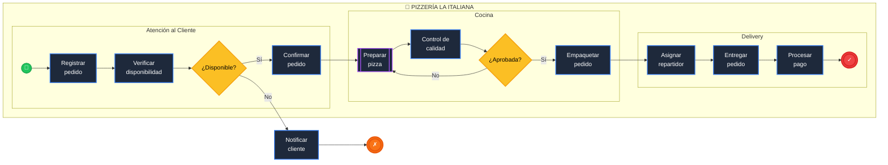

# 🍕 Proceso de Negocio - Pizzería La Italiana

## Descripción del Proceso BPMN 2.0

Este documento describe el proceso de negocio para la gestión de pedidos en una pizzería, modelado según el estándar BPMN 2.0.

---

## Flujo Principal

1. **Pedido recibido** → **Registrar** → **Verificar disponibilidad**
2. Si disponible → **Confirmar** → **Preparar pizza** → **Control calidad**
3. Si aprobada → **Empaquetar** → **Asignar repartidor** → **Entregar** → **Cobrar** → **Fin**

---

## Flujos Alternativos

- **No disponible** → Notificar cliente → Fin (cancelado)
- **No aprobada** → Vuelve a preparar pizza

---

## Diagrama BPMN

---

## Leyenda de Símbolos

| Símbolo | Elemento BPMN | Descripción |
|---------|---------------|-------------|
| ⭕ | Evento de inicio | Inicia el proceso (mensaje recibido) |
| ⬛ | Tarea | Actividad a realizar |
| ⬛⬛ | Subproceso | Proceso anidado con múltiples pasos |
| ◇ | Gateway XOR | Decisión exclusiva (solo una ruta) |
| ⭕ | Evento de fin | Finaliza el proceso |

---

## Participantes (Lanes)

| Lane | Responsabilidades |
|------|-------------------|
| **Atención al Cliente** | Recibir pedido, verificar disponibilidad, confirmar |
| **Cocina** | Preparar pizza, control de calidad, empaquetar |
| **Delivery** | Asignar repartidor, entregar, cobrar |

---

*Documento generado según estándar BPMN 2.0 - ISO/IEC 19510*
